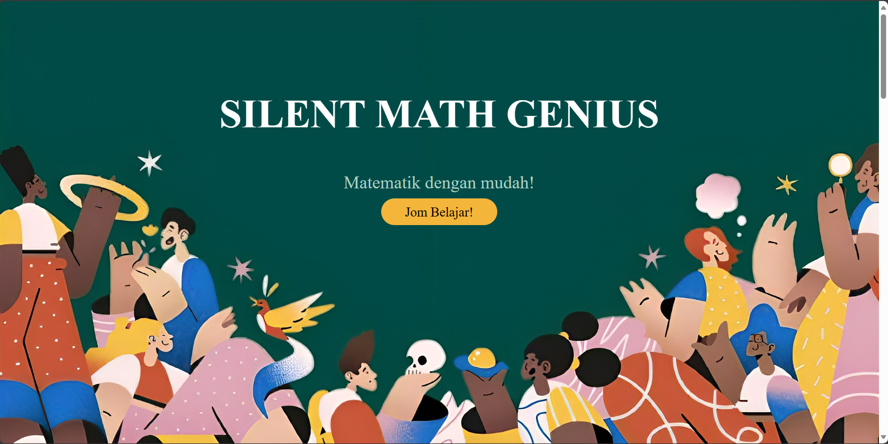
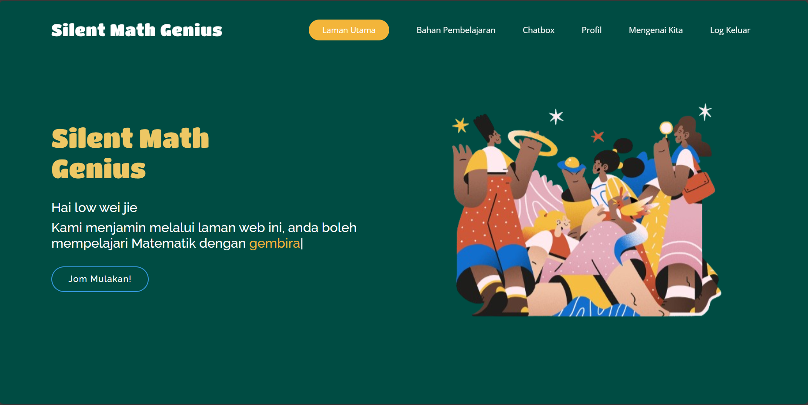

<h1>SILENT MATH GENIUS</h1>

<strong>Subject: </strong>SKIG3013(A) Mobile Web Development

<strong>Instructor: </strong>	Ts. Dr. Juhaida Binti Abu Bakar

<strong>Team Members: </strong>Tracy Liaw Mien Yee, 287944 | Low Wei Jie, 289669 | Wong Li Ying, 289902

## Table of Contents
- [Abstract](#abstract)
- [Introduction](#introduction)
- [Objective](#objective)
- [Methodology](#methodology)
- [Prototype](#prototype)
- [Acknowledgements](#acknowledgements)

## Abstract
The prevalence of auditory-centric strategies in the mainstream mathematics education creates barriers for deaf-mute and hearing-impaired students, often impeding their academic progress. The "Silent Math Genius" project proposes a suite of innovative instructional methods, tailored educational resources, and specialized evaluation techniques designed to equip these students with the mathematical proficiency and practical skills necessary for academic achievement and everyday problem-solving. By employing the Double Diamond Design Process Model, the project unfolds through four primary stages: Discover, Define, Develop, and Deliver. The data collection encompasses defining the project scope, conducting topic research, data collection, stakeholders engagement, and ideation. Project team has built the technological framework using HTML5, CSS3, JavaScript, Python, and the Flask Framework. "Silent Math Genius" offers substantial pedagogical advantages to its users, which include deaf-mute and hearing-impaired students as well as special education instructors. The accessibility of diverse educational materials—ranging from instructional notes to interactive activities and games—aims to enhance the efficacy of the learning experience.

## Introduction
In response to UNESCO's recent revisions in educational guidelines, there is now a universal mandate for the inclusion of all students in mainstream education, irrespective of their disabilities or other limitations Constantinou (2018). This significant policy shift aims to eliminate any form of marginalization within the traditional educational framework, ensuring that every student has equal access to learning opportunities. In traditional classroom environments, Deaf and Hard of Hearing (DHH) students often exhibit comparatively lower academic performance than their peers with typical hearing (Matthew, 2013). This disparity is particularly evident in language proficiency, where DHH students frequently demonstrate a notable gap in competence (Wang, 2006).

## Objective

The primary aim of this study is to enhance mathematics education, focusing on addressing the substantial challenges associated with "Nilai Tempat Perpuluhan" and "Matematik Pengguna". To achieve this, the study sets forth the following specific objectives:

- To enhance students understandment towards certain topic
- To explore innovative teaching methods and strategies for effective and engaging instruction
- To develop online educational resources that boost study efficiency 
- To emphasize the practical significance and advocate for integration into the curriculum
- To provide practical approaches and real-world examples
- To explore methods for assessing and measuring students' proficiency

## Methodology
The current method to be used for developing the Silent Math Genius would be the Double Diamond Model. The double diamond model was chosen as it is a compact methodology with a systematic alignment of events to be carried out for developing a prototype. This methodology also brings benefits to the whole project since it can provide a structured approach to design and innovation, allowing the core team members to grasp quickly the means and tricks to tackle challenges throughout the whole project. Within this model, it consists of four phases, which are discover, define, develop, and deliver phase.

## Prototype
In this section, the system has already been developed with all successful functionality. Both user types have been tailored with suitable interface and provide the flexibility to perform all activities within the system. The system also supports responsiveness, where the system is able to perform fluently and interactively in different window screen.

<strong>Landing Page</strong>

*Landing Interface*

<strong>Sign Up and Log In Page</strong>

*Sign Up Interface*

*Log In Interface*

<strong>Home Page</strong>

*HomePage Interface for Student*

*HomePage Interface for Instructor*

<strong>Profile Page</strong>

*Profile Interface*

<strong>About Us Page</strong>

*AboutUs Interface*

<strong>Resource Page : Student View</strong>

*Student: Topic View Interface*

*Student: Topic Detail Interface*

*Student: Note Type Interface*

*Student: Exercise Type Interface*

*Student: Game Interface*

*Student: Quiz Interface*

<strong>Resource Page : Instructor View</strong>

*Instructor: Add Activity*

<strong>Chat Page</strong>

*Student: Chat Interface*

*Instructor: Chat Interface*

## Acknowledgements
This research received no specific grant from any funding agency in the public, commercial, or not-for-profit sectors.
